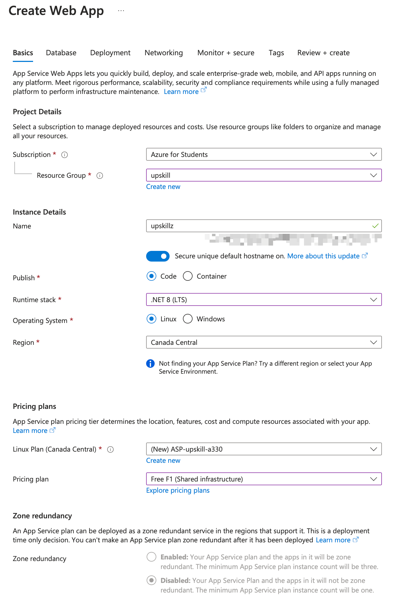
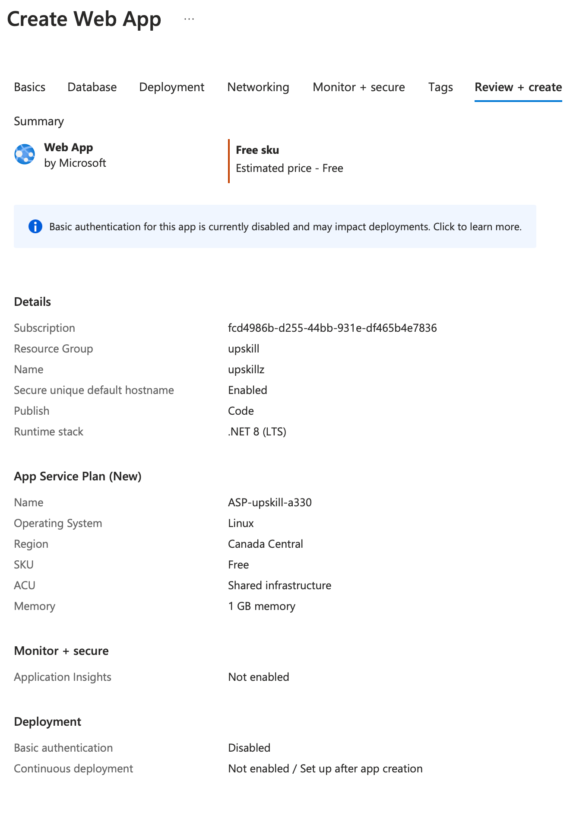
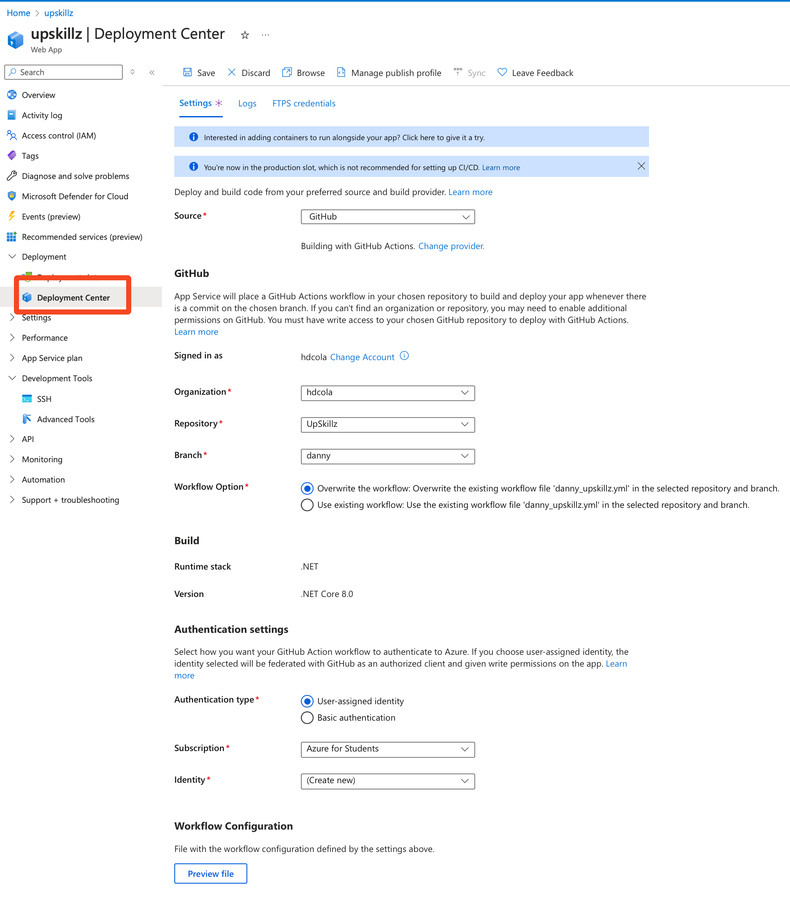

# Build and deploy ASP.Net Core app to an Azure Web App

## Setup Azure Web App

1. Create a new Azure Web App

2. Setup Github Actions
    - Go to the Azure Web App
    - Click on `Deployment Center`
    - Click on `GitHub`
    - Click on `Authorize` and authorize the Azure Web App to access your Github account
    - Select the repository and branch
    - Click on `Save`
    - Click on `Continue`
    - Click on `Finish`

